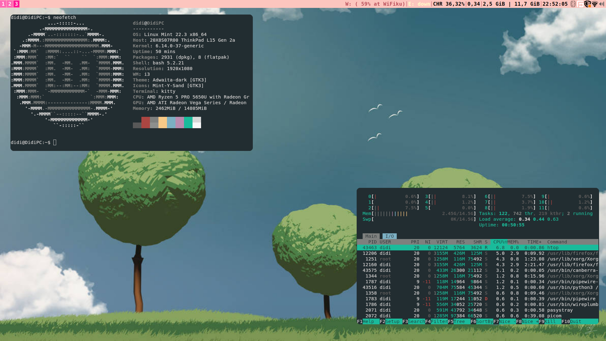
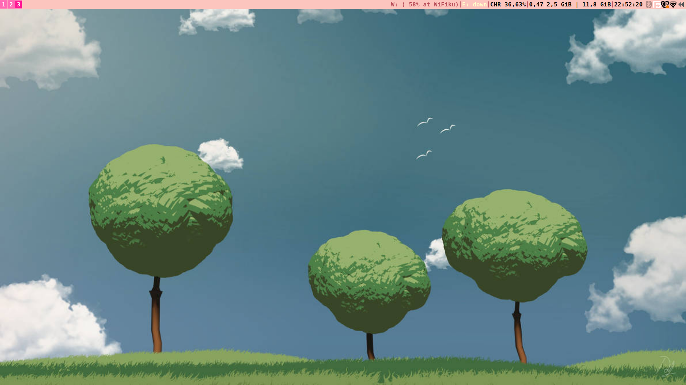

# 🌸 DdM i3 Dot



A customized, borderless i3wm setup with a hot-pink aesthetic.

> [!CAUTION]
> **WARNING:** The setup script will install packages using `sudo` and overwrite existing configurations in `~/.config/`. Back up your current files before proceeding!

## 🚀 Fast Installation (Arch & Debian)

If you have cloned this repository to `~/dotfiles`, run the following commands:
# 1. Clone the repo
```bash
git clone https://github.com/DidiSlothStanca/ddmi3dot.git ~/dotfiles
```
# 2. Enter directory and run setup
```bash
cd ~/dotfiles
```
```bash
chmod +x setup.sh
```
```bash
./setup.sh
```
## 📦 Required Dependencies

Install the following packages based on your Linux distribution:


--------------------------------------------------------------------------------------------------
# Optional if you can't install, It's work for Xorg & Xlibre, but for Wayland? idk if doesn't work or work
### 1. Arch Linux
```bash
sudo pacman -S i3-wm rofi kitty thunar feh picom nm-applet pasystray kazam dex i3status xss-lock i3lock pulseaudio xorg-xrandr
```
### 2. Debian Linux
```bash
sudo apt update && sudo apt install i3 rofi kitty thunar feh picom nm-applet pasystray kazam dex i3status xss-lock i3lock pulseaudio x11-xserver-utils
```
### 3. Arch Linux
```bash
sudo xbps-install -S i3 rofi kitty Thunar feh picom nm-applet pasystray kazam dex i3status xss-lock i3lock pulseaudio xrandr
```
### 4. Alpin Linux
```bash
sudo apk add i3wm rofi kitty thunar feh picom network-manager-applet pasystray kazam dex i3status xss-lock i3lock pulseaudio xrandr
```
---
## ⌨️ Keybindings (Mod = Windows / Super Key)

### Applications & Essentials
| Key Combination | Action |
| :--- | :--- |
| **$mod + Return** | Open Default Terminal |
| **$mod + t** | Open Kitty Terminal |
| **$mod + d** | Open Rofi App Launcher |
| **$mod + c** | Open Thunar File Manager |
| **$mod + q** | Kill Focused Window |
| **Print** | Take Screenshot (Kazam) |
| **$mod + Shift + c** | Reload Configuration |
| **$mod + Shift + r** | Restart i3 In-place |
| **$mod + Shift + e** | Exit i3 (Logout) |

### Window Focus & Movement
| Key Combination | Action |
| :--- | :--- |
| **$mod + j / k / l / ;** | Focus (Left, Down, Up, Right) |
| **$mod + Arrow Keys** | Focus in direction |
| **$mod + Shift + j / k / l / ;** | Move Window Position |
| **$mod + Shift + Arrow Keys** | Move Window Position |
| **$mod + space** | Toggle Focus (Floating/Tiling) |
---
### Layout & Workspaces
| Key Combination | Action |
| :--- | :--- |
| **$mod + h / v** | Split Horizontal / Vertical |
| **$mod + f** | Toggle Fullscreen |
| **$mod + w / s / e** | Layout (Tabbed, Stacking, Toggle Split) |
| **$mod + Shift + space** | Toggle Floating Mode |
| **$mod + a** | Focus Parent Container |
| **$mod + [1-0]** | Switch to Workspace 1 - 10 |
| **$mod + Shift + [1-0]** | Move Window to Workspace 1 - 10 |

### Multimedia & System Control
| Key Combination | Action |
| :--- | :--- |
| **AudioRaiseVolume** | Volume Up (+10%) |
| **AudioLowerVolume** | Volume Down (-10%) |
| **AudioMute** | Toggle Audio Mute |
| **AudioMicMute** | Toggle Mic Mute |
| **$mod + r** | Enter **Resize Mode** (Esc/Enter to exit) |

### Mouse Bindings
| Key Combination | Action |
| :--- | :--- |
| **$mod + Right Click** | Toggle Floating + Resize 40% + Move Center |
| **$mod + Left Click (Hold)** | Drag Floating Windows |

---

---
## 🎨 Aesthetic Details
- **Gaps:** Inner 10px, Outer 5px.
- **Borders:** Borderless design (0px).
- **Colors:** Focused (#FF69B4), Inactive (#FFB6C1).
- **Bar:** Positioned at the Top.
## 🎨 Autostart Configuration

-   feh (wallpaper)
-   picom (compositor)
-   nm-applet (network tray)
-   pasystray (audio tray)
-   xrandr (screen resolution)
-   dex (XDG autostart)

---

## 📁 Directory Structure

``` text
~/.config/i3/config
~/.config/picom/picom.conf
~/.config/rofi/config.rasi
~/Pictures/WP/
```

------------------------------------------------------------------------

## ⚠️ Notes

-   Mod key = Super (Windows key)
-   Make sure wallpaper path is correct
-   Adjust xrandr settings based on your monitor
-   Designed for X11 environment

------------------------------------------------------------------------

## ❤️ Credits
it) ~/dotfilesit) ~/dotfilesit) ~/dotfiles
Enjoy and customized by the user.
